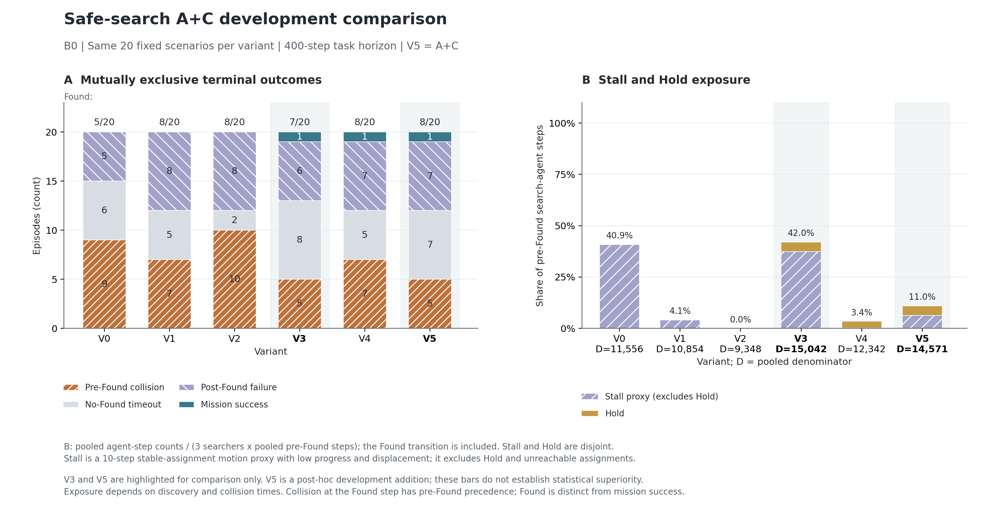

# A+C 固定 20 场景完整回合实验结果

**A+C（V5）通过本轮预先冻结的开发门槛：明显改善了 C 单独开启时的停滞，保留了相同的发现前碰撞总数；Found 从 7/20 增至 8/20。** 这支持将 A+C 保留为下一轮开发基线，但还不足以证明 Found 有稳定的统计提升，也没有完成独立论文测试。

本次新增实际执行 20 个 V5 完整回合，共 **6,315 个物理步，0 个程序失败**。使用与旧 V0–V4 相同的 B0、固定 20 场景、`12729 + 原始索引` 种子和 400 步任务上限。碰撞、成功按原任务条件提前终止；其余回合跑满 400 步。未训练、未加载 checkpoint，未运行其余 80 场景。

## 设置与比较关系

| 变体 | A：规划状态一致性 | B：失败处理 | C：路径安全 |
|---|---|---|---|
| V0 | 关闭 | 关闭 | 关闭 |
| V1 | 开启 | 关闭 | 关闭 |
| V2 | 开启 | 开启 | 关闭 |
| V3 | 关闭 | 关闭 | 开启 |
| V4 | 开启 | 开启 | 开启 |
| **V5** | **开启** | **关闭** | **开启** |

A 在需要规划、起点过期或安全恢复需要时刷新公共规划快照，连接连续运动位置与当前离散图。B 包含无效起点预检、候选短路与失败重试管理。C 根据最新公共地图检查当前跟踪段与剩余路线，尝试同目标重规划，失败则 Hold 制动。C 没有新增按速度计算的停止距离控制，也没有固定空间锚点或安全释放滞回。

V5 对 V3 是加入 A 的主要比较；V5 对 V4 是移除 B 的次要比较。本轮只增加组合、运行入口和分析工具，A/B/C 原实现、动力学、感知、奖励和任务终止条件不变。旧五组的历史选择 **V3 保持原样**；新的 A+C 门槛单独记录。

## 完整结果

| 方案 | Found | 发现前碰撞 | 未发现超时 | 完整任务成功 | 停滞 + Hold | 有效观察步数／发现前步数 |
|---|---:|---:|---:|---:|---:|---:|
| V0 原基线 | 5/20（25%） | 9/20（45%） | 6/20 | 0/20 | 40.87% | 1,055 / 3,852（27.39%） |
| V1 A | 8/20（40%） | 7/20（35%） | 5/20 | 0/20 | 4.07% | 1,582 / 3,618（43.73%） |
| V2 A+B | 8/20（40%） | 10/20（50%） | 2/20 | 0/20 | 0.01% | 1,425 / 3,116（45.73%） |
| V3 C | 7/20（35%） | 5/20（25%） | 8/20 | 1/20 | 42.05% | 1,425 / 5,014（28.42%） |
| V4 A+B+C | 8/20（40%） | 7/20（35%） | 5/20 | 1/20 | 3.43% | 1,859 / 4,114（45.19%） |
| **V5 A+C** | **8/20（40%）** | **5/20（25%）** | **7/20** | **1/20** | **10.97%** | **2,065 / 4,857（42.52%）** |

停滞为原有低运动进展代理，排除 Hold。V5 停滞 925 个搜索者步、Hold 673 个搜索者步；合计 1,598 / 14,571 = 10.97%。分母为三个搜索者的汇总发现前步数，包含 Found 发生的转移步。有效观察指至少出现一个新网格观察或间隔至少 30 步的重访；它不是目标检测概率。反复观察同一区域仍可能发现移动目标。

V5 的 8 个 Found 中，1 个完整成功、7 个发现后超时。剩余 12 个未发现回合由 5 个搜索者碰撞和 7 个超时组成；没有发现后碰撞，也没有执行者碰撞。Found 与完整任务成功不能混为一项指标。

## A+C 的收益和代价

相对 V3，停滞加 Hold 降低 **31.08 个百分点**，有效观察占比提高 **14.10 个百分点**。有效观察总步数从 1,425 增至 2,065，平均去重观察网格占比从 25.48% 增至 31.06%。发现前总时间反而从 5,014 降至 4,857 步，说明此次收益不能仅解释为“活得更久”；不过曝光时间受发现和碰撞时刻共同影响，也不能单凭总量推出因果。

主要改善出现在运动执行与连续位置连接。V3 记录 1,039,835 次 `no_start_connector` 查询，V5 为 23 次；安全重规划因这一原因失败的次数从 670 降至 18，同目标安全替换从 4 次增至 45 次。查询次数包含重复候选枚举，不代表独立失败次数，更不能解释为物理地图不可达比例。

相对 V4，V5 Found 数相同，发现前碰撞少 2 场，但停滞加 Hold 从 3.43% 增至 10.97%，有效观察占比从 45.19% 降至 42.52%。未发现按 400 步计的截断发现时间，V5 为 313.10 步，V4 为 290.35 步。移除 B 带来安全与推进之间的取舍，不能据此认为 B 没有用。

V5 仍有 116,882 次发现前 `invalid_start` 查询；V4 为 1,784 次。关闭 B 的预检短路后，重复无效起点查询重新成为主要计算浪费。重新加入预检是否可以保留 V5 安全性，需要将预检与恢复运动分开验证，当前结果没有直接验证这一新组合。

## 配对结果与不确定性

以下均为原始零基索引。场景显示编号等于索引加一。

| V5 对照 | 新增 Found | 丢失 Found | Found 差值及配对 95% 区间 |
|---|---|---|---|
| V3 | 42、63、86 | 10、97 | +5 个百分点，[-15, +25] |
| V0 | 3、31、42、63、86 | 10、97 | +15 个百分点，[-10, +40] |
| V4 | 3、95 | 67、77 | 0 个百分点，[-20, +20] |

V5 相对 V3 消除了索引 0 的碰撞，但新增索引 77 的碰撞。因此，“碰撞总数相同”不代表每一个原有安全场景都保持安全。相对 V4 消除了索引 0、62、95 的碰撞，同时新增索引 77 的碰撞。

配对区间使用 20 个场景、10,000 次 percentile bootstrap、种子 20260928。V5 相对 V3 的碰撞差值区间为 [-15, +15] 个百分点；相对 V4 为 -10 个百分点，区间 [-30, +10]。Found 和碰撞区间均包含零，不报告统计优越性。

门槛中的率使用汇总计数除以汇总曝光；逐场景率差的 bootstrap 使用另一种聚合，不能将其区间附在上述汇总率差上。按逐场景率差计算，V5 对 V3 的停滞加 Hold 平均下降 27.00 个百分点，区间 [-36.43, -16.51]；有效观察平均提高 11.46 个百分点，区间 [6.12, 16.04]。这些仍是未经多重校正的开发性结果。

## 已查明的残留问题

**等待减少并不保证发现。** 索引 28 中，V3 在起点快照过期时产生大量 `no_start_connector`；V5 刷新快照后获得可达候选。最长完成旧目标后的等待从 125 个状态降至 3 个，V5 停滞代理为零，但仍跑满 400 步未发现。索引 3 中 V5 虽补回了 V4 丢失的 Found，却在 295 步发现，晚于 V3 的 160 步。这两个例子不支持把“更多运动”直接等同于“更早发现”。

**Hold 仍可能刹不住。** 索引 40 的 V4/V5 在全部 15 个状态中，持久化的智能体位置、速度、Hold、目标与碰撞记录一致，但完整仿真签名不同。两个 Hold 动作状态的速度仍约为 0.94、0.71，随后第 14 步碰撞。索引 7 的致死搜索者在 V4/V5 中，位置、速度、目标和 Hold 全序列一致，第 84 步均碰撞；整队轨迹并不相同，不能套用旧 V4 的全图重放作为 V5 地图证据。

V5 的 5 次致死碰撞中，4 次碰撞前的指导已为 Hold。新增的索引 77 在状态 279 换路线时速度约 1.76、速度与跟踪方向夹角约 80.81°；状态 281 进入 Hold 时仍有约 1.14 的速度，随后第 282 步碰撞。这支持单独验证转向和制动限速，但当前轨迹没有障碍首次可见时间，不能据此断定障碍发现延迟或地图占用翻转。V4/V5 从状态 22 已开始物理分歧，也不能将 V4 第 130 步 Found 的丢失归因于 V5 最后的碰撞。

**单个失败仍能阻塞其他搜索者的更新。** 索引 7 中，一名健康搜索者已经完成旧路线并有 4 个可达候选，却因另一名搜索者的 `invalid_start` 被多次整批拒绝，旧目标一直保留到第 80 个状态。A+C 没有改变原子的任务更新规则。

**后期搜索仍会失去新证据。** 7 个未发现超时回合的最后 100 步，有效观察占比从第一窗口的 46.43% 降至 33.14%。只有索引 97 的最后 100 步完全没有新网格或间隔重访，连续尾部达到 206 步；其目标证据更新调用和非空观察仍在进行，不能描述为传感器停摆或地图更新完全停止。索引 97 与 10 合计占 788/925（85.19%）的 V5 停滞代理步，值得优先诊断，而不是继续统一调整所有场景。

**待命执行者事件会挤占搜索恢复。** 索引 97 从状态 124 到 400 不再产生搜索候选查询：14 个状态标记为 `REJECT_NO_ASSIGNMENT_CHANGE`，其余 263 个状态标记为 `REJECT_EVENT_COOLDOWN`；实际调用只尝试处理不可达的执行者待命目标，三个搜索者最终全部完成旧路线但无法推进。这是记录的状态标签计数，不将其直接当作独立决策调用次数。索引 10 在 270–400 出现同型过程。这不是原子候选拒绝：两例相关停滞的搜索候选查询根本没有被调用。

源码的事件优先级将 `EXECUTOR_INVALID` 放在 `WAYPOINT_STALE` 之前；冷却分支直接返回，发现前的执行者无效分支也只处理执行者。V4 在索引 97 同样遇到待命目标无效，但 B 的 `SAFE_SEARCH_RECOVERY` 从状态 138 起提供了旁路恢复。该差异解释了为什么直接关闭 B 会重新出现长停滞；修复此调度问题能否补回 Found，仍需新实验验证。

上述病例见 [前七个已完成病例审计](../ac_completed_cases_audit.json)、[索引 7 逐状态审计](../ac_case7_audit.json) 与 [最终配对病例审计](../ac_final_cases_audit.json)。它们是具体机制证据；结果分组后的窗口统计不能单独识别因果。

## 下一步建议

保留 V5 作为下一轮开发参考，首先在独立 opt-in 实验层拆分发现前的待命执行者修复与搜索恢复调度，使执行者事件及其冷却不再阻塞搜索者重新分配，先用索引 97、10 验证候选查询和新证据能否恢复。冻结 Phase 1B 行为保持不变。

第二项单独验证按当前速度与可用制动能力提前减速，并为 Hold 释放增加持续安全条件，关注索引 40、7 和新增碰撞的 77。后续再分别检查原子更新耦合和无效起点预检；不要把 B 的全部恢复行为一起加回并将收益归给预检。不同修复应分组，便于判断安全性和 Found 的变化来源。

这些都是待验证方案，本次没有继续改动控制器或追加实验。搜索修复仍可先在 B0 上做无需训练的配对验证；将来若改动学习策略的观测、动作或训练目标，应另行讨论重新训练。本轮结果只支持 A+C 的开发价值，不能宣称训练完成、`performance_passed` 或论文正式验收。

## 验证与复现证据

运行前本地安全搜索相关测试 140 项通过；两个 30 步机制前缀和两条各 400 步的旧方案重放均通过，未计入 V5 分母。旧方案重放核对完整有序物理签名与任务字段，只排除墙钟耗时。旧 100 回合保留其独立旧源码身份，没有改写为在新源码下运行。

新受保护清单 337 个文件、历史 27 条来源记录通过检查；运行前、运行后与最终检查的源码完全相同。分析器重新核验旧 100 与新 20 回合的终止摘要、连续轨迹、覆盖、停滞、Hold、输入哈希。原始结果仍留在被忽略的 `runs/`，3090 文件、模型和 `outputs/` 未上传，未执行 commit 或 push。测试是最新本地验证，不是 CI；历史旧 baseline 门禁问题仍按此前报告保留。

- [全部指标、配对明细与来源哈希](analysis.json)
- [自动生成的结果摘要](analysis.md)
- [独立数值与来源复核](final_numeric_audit.json)
- [冻结实验方案](../ac_experiment_plan.json)
- [运行说明与命令](../ac_runbook.md)
- [源码精确差异审查](../ac_source_diff_review.json)
- [前置验证记录](../ac_preflight_verification.json)
- [可导出 PDF 图](figures/ac_development_diagnostics.pdf)
