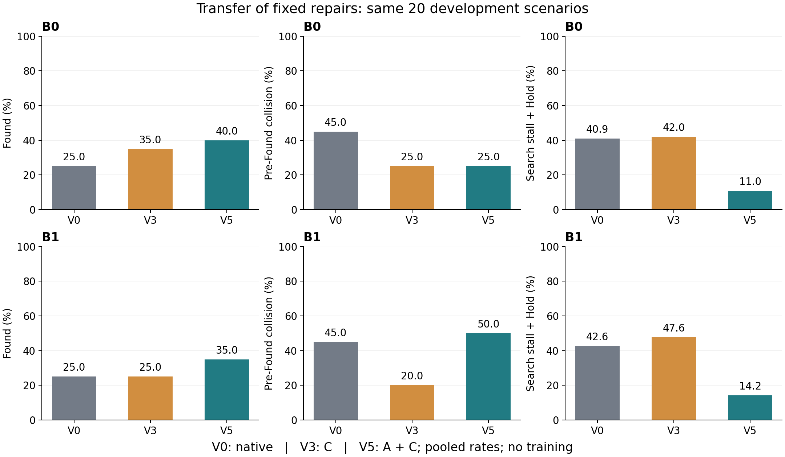
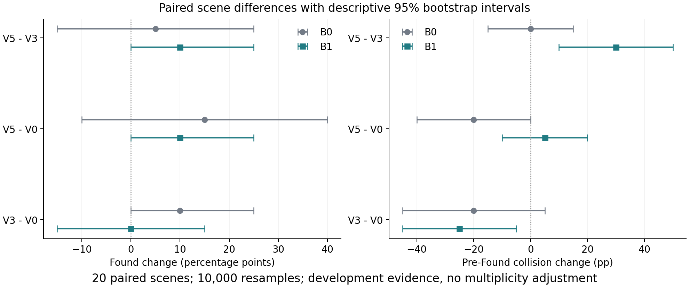

# B1 配对实验与 B0 修复迁移诊断

实际运行日期：2026-09-28 至 2026-09-29；本地 Windows AUV Python/CPU 环境。

**结论：A+C 的规划状态修复和搜索活动改善可以迁移到 B1，但当前 V5 整体不能直接设为 B1 默认。** V5 的 Found 达到 7/20，高于 V0/V3 的 5/20；发现前碰撞却达到 10/20，高于 V3 的 4/20，也高于 V0 的 9/20。事先冻结的迁移门槛因碰撞增加而失败。

本轮结论针对安全执行、候选恢复和发现后规划连接的具体缺陷；应先修这些链路，再评价联合分配和 HGR 的算法收益。

## 实际执行与设置

新增 B1 专用调度入口 `chapter3_bser/experiments/safe_search_v1/run_b1_development.py`、固定实验计划及离线配对／轨迹／数值／动力学诊断工具。B1 使用原有 BSER 联合搜索与执行者待命分配，`method` 与 `reference_runtime_method` 均核验为 `ch3_baseline_bser_prior`。V3/V5 在这一联合分配器上启用独立安全搜索变体。

- V0：原生 B1。
- V3：C，已知公共障碍路径检查、同目标重路由或 Hold。
- V5：A+C，在 C 基础上按原有条件刷新规划状态与连续起点连接。
- 三组 B 均关闭；A/C 参数沿用 B0，运行中没有调参。

同一冻结 20 场景、原始索引随机种子 `12729 + index`、最长 400 步、任一智能体碰撞全队终止。实际完成 **60/60 个终止回合、17,216 个物理步、0 个程序错误**。主运行墙钟约 77.68 分钟。各回合四个智能体学习残差和物理残差均为零，actor、采样和优化器调用均为零。没有训练、模型加载、HGR 运行或剩余 80 场景评估。

此前 2 场景 × 3 变体短程检查共 168 步，另外 48 步原生 V0 对照逐步一致；这些检查均不计入 60 回合。最新记录的本地验证为 146 项安全搜索测试及 3 项 B1 分析测试通过，主要数值另用独立计算路径复核。这里不代表全仓库测试或 CI 全通过。

## 完整指标

| 基线 | 版本 | Found | 完整任务成功 | 发现前碰撞 | 停滞＋Hold | 有效观测比例 |
| --- | --- | --- | --- | --- | --- | --- |
| B0 | V0 | 5/20 (25%) | 0/20 | 9/20 (45%) | 40.87% | 27.39% |
| B0 | V3 | 7/20 (35%) | 1/20 | 5/20 (25%) | 42.05% | 28.42% |
| B0 | V5 | 8/20 (40%) | 1/20 | 5/20 (25%) | 10.97% | 42.52% |
| B1 | V0 | 5/20 (25%) | 0/20 | 9/20 (45%) | 42.64% | 24.47% |
| B1 | V3 | 5/20 (25%) | 1/20 | 4/20 (20%) | 47.62% | 24.40% |
| B1 | V5 | 7/20 (35%) | 1/20 | 10/20 (50%) | 14.17% | 41.34% |

Found、成功和碰撞的分母均为 20 回合。“停滞＋Hold”是互不重复的搜索者计数，除以三名搜索者的发现前总暴露步数；有效观测是实际目标证据中出现新格子或足够间隔重访的步数，除以发现前总步数。有效观测不是目标检测概率。表中比例均由总计数／总暴露计算。

B1 原始计数：V0 暴露 4,176 步、停滞 5,342 智能体步、Hold 0、有效观测 1,022 步；V3 分别为 5,624、7,281、754、1,372；V5 分别为 4,451、682、1,210、1,840。V5 虽然总停滞减少，但 Hold 数量增加，必须检查 Hold 本身是否安全。

V3 将发现前碰撞从 9 降到 4，却没有净增加 Found，未发现超时由 6 增至 11。V5 则有 10 个发现前碰撞、3 个未发现超时、6 个发现后超时和 1 个完整成功。因此 V3 是更安全的对照，V5 保留了更多搜索活动；本轮没有证明任何一个已经是最终 B1 最优方案。

## 配对结果与迁移判定

主比较 **B1 V5−V3**：

| 指标 | 配对差值 | 描述性 95% bootstrap 区间 |
| --- | --- | --- |
| Found | +10 个百分点 | [0, +25] 个百分点 |
| 发现前碰撞 | +30 个百分点 | [+10, +50] 个百分点 |
| 完整成功 | 0 个百分点 | 本组逐场景一致；重采样区间退化为 0，不能证明总体等价 |
| 每场景停滞＋Hold 比例的平均差 | −28.17 个百分点 | [−38.12, −18.07] |
| 每场景有效观测比例的平均差 | +13.27 个百分点 | [+8.37, +18.07] |

新增 Found 场景为 **95、97**，没有 Found 丢失。新增碰撞场景为 **7、46、63、67、78、86**，没有避免任何 V3 原有的碰撞回合。场景编号均为原始零基索引。

V5−V0：Found +10 个百分点，[0, +25]；碰撞 +5 个百分点，[−10, +20]。V3−V0：Found 0，[−15, +15]；碰撞 −25 个百分点，[−45, −5]。

配对区间以 20 个场景为重采样单位，10,000 次、种子 20260928；不是 60 个独立样本，未作多重比较校正。配对场景平均差与上表总量加权比例的差采用不同权重，不应混用。

B0 的 V5−V3 为 Found +5、碰撞 0 个百分点；B1 对应为 +10、+30。两者优化效应之差为 Found +5 个百分点（区间 [−25,+35]）、碰撞 +30（[+5,+55]）。这些用于描述同一开发集的迁移差异，不能替代独立泛化验证。

冻结门槛要求 Found 不降低、碰撞不增加、停滞＋Hold 降低、有效观测不降低。B1 V5 满足其中三项，**碰撞项失败，门槛不通过**。原有 B0 V0–V4 的历史 V3 选择没有改写；B0 V5 仍是单独的后续开发候选。

## 失效原因与证据

### 1. A 修复了大量规划连接失配，但没有解决全部无效起点

B1 发现前实际查询中，`no_start_connector`：V0 1,029,310 次，V3 1,379,401 次，V5 **30 次**。V5 的 `invalid_start` 仍有 **243,471 次**，V3 为 18,207 次。前者大幅下降支持规划状态一致性修复有效，后者说明起点有效性和失败后的恢复仍是问题。查询次数不是物理地图不可达比例，部分检测查询也会随包装器增加。

场景 0 的 V5 后期，搜索者 0 因 `invalid_start` 没有候选，搜索者 1、2 各有 4 条可达候选，但仍触发 `ATOMIC_REJECT_MISSING_SEARCH_ROUTE`。搜索者 1 在状态 285–399 连续 115 步、搜索者 2 在 280–399 连续 120 步完成旧路线后停滞。对应原子拒绝规则在 `chapter3_bser/online/allocator.py:262`，应在独立变体里验证逐智能体失败隔离，保留联合分配的目标定义。

### 2. 当前 Hold 不是定点悬停，水流可使其长期漂移至碰撞

`safe_guidance.py:156` 每步将 Hold 位置设置为当时的当前位置；`uav_env.py:976` 的速度反馈因此得到零位置误差，而 `uav_env.py:1060` 仍施加水流。速度反馈可以减速，却不保证在固定空间位置停住。

B1 V5 场景 46：从状态 197 开始连续 Hold **114 步**，移动 **4.22 米**，第 311 步碰撞；最后几步速度约 0.20。按实际配置和记录重算 305–309 的 5 次非终止状态转移，最大速度分量误差 **1.10×10⁻⁸**，验证了这一实际动力学链路。此核对没有启动新仿真或改变环境。

同类长期 Hold 后碰撞还有场景 77（106 步、2.58 米）和 86（44 步、1.42 米）。旧 B0 V5 的场景 46 也有 Hold 33 步、移动 1.46 米后碰撞；这是共享执行缺陷，不是 B1 独有问题。

### 3. 短时 Hold 也缺乏充分的制动距离保证

B1 V5 的 10 次发现前碰撞中，**8 次碰撞前已 Hold**。场景 7 在状态 328、329、330 连续 Hold，速度约 1.017、0.789、0.589，第 331 步仍碰撞。这与上述长期漂移不同，是有限制动过程未能在碰撞前结束的案例。当前静态路径余量没有给出基于速度、控制能力和扰动的停止距离保证。

日志不足以逐一断定所有碰撞都是首次发现障碍太晚，不能把该假设写成已证实结论。

### 4. B1 的执行者待命路径未被 C 保护

`safe_guidance.py:92` 明确跳过执行者。场景 77 的 B1 V3 在第 **72 步**由执行者碰撞终止，尚未 Found，碰撞前未进入 Hold。V3 的 4 次发现前碰撞为 3 次搜索者、1 次执行者；V5 本次 10 次均为搜索者。执行者保护范围确有缺口，但不能据此把所有 V5 失败都归因于执行者。

### 5. Found 后连续起点连接问题重新出现

V5 发现目标的 7 回合中只有 1 回合成功，另外 6 回合发现后超时。6 个超时回合的发现后 1,348 步中，执行者 **1,222 步（90.65%）**处于不可达状态。

场景 3 在第 153 步 Found，第 174 步公共目标更新时查询失败：缓存地图版本 161、实时版本 168，`start_endpoint_present=false`、`goal_endpoint_present=true`、失败原因 `no_start_connector`。这直接定位到规划图起点连接，不是物理目标不可达证明。6 个超时回合都在 Found+21 首次进入这一不可达状态；成功的场景 31 也曾短暂出现，但恢复后完成。

`safe_search_v1/runtime.py` 在 `state.target_found` 后直接交还原控制器，A 不再介入这一阶段。下一轮应对公共目标更新／执行者重规划时的当前起点绑定做独立修复；不能只增加训练轮数或把发现后的停滞当成策略能力不足。

## 下一轮建议（本次尚未执行）

优先保留 A 的规划一致性能力，修复 C 的执行缺陷，而不是直接把当前 V5 用作新的正式基线。

1. **先验证稳定 Hold。** 在独立安全引导命名空间保存进入 Hold 时的固定安全锚点，约束锚点选择与漂移；以场景 46、77、86 作完整回放，再用同一 20 场景比较 V5 与“V5＋稳定 Hold”。固定锚点本身仍需安全余量验证，不能宣称天然防碰撞。
2. **单独加入速度相关的制动与转弯约束。** 用场景 7、40、63、67、78 检查制动距离与转弯切换，保留实际惯性和水流。随后将发现前执行者待命纳入同一安全检查，专门回放场景 77 的执行者失效。原有碰撞终止规则和动力学保持不变，修改限于独立安全引导层。
3. **修复失败恢复与执行阶段起点绑定。** 对场景 0 测试单个候选失败不阻断健康搜索者更新；对 3、22、42、76、95、97 测试公共目标更新前刷新并绑定执行者的当前连续起点。分开开关、分开记录收益，保持旧实现与证据冻结。

这些是规划／控制链路修复，B0、B1 可继续用零残差配对验证，**不需要重新训练**。待共同执行条件稳定、锁定配置后，再讨论剩余场景的评估及 HGR 的独立验证；本次结果不能证明 HGR 随后一定有效。

## 逐场景结果

F 为首次发现步；“—”表示未发现。所有记录均为真实终止，最长 400 步。

| 原始索引 | B1 V0 | B1 V3 | B1 V5 |
| --- | --- | --- | --- |
| 0 | 未发现超时；F=—；终止=400 | 未发现超时；F=—；终止=400 | 未发现超时；F=—；终止=400 |
| 3 | 搜索者碰撞；F=—；终止=18 | 发现后超时；F=160；终止=400 | 发现后超时；F=153；终止=400 |
| 7 | 搜索者碰撞；F=—；终止=44 | 未发现超时；F=—；终止=400 | 搜索者碰撞；F=—；终止=331 |
| 10 | 未发现超时；F=—；终止=400 | 未发现超时；F=—；终止=400 | 未发现超时；F=—；终止=400 |
| 22 | 发现后超时；F=23；终止=400 | 发现后超时；F=23；终止=400 | 发现后超时；F=23；终止=400 |
| 28 | 未发现超时；F=—；终止=400 | 未发现超时；F=—；终止=400 | 未发现超时；F=—；终止=400 |
| 31 | 发现后超时；F=177；终止=400 | 任务成功；F=18；终止=98 | 任务成功；F=18；终止=98 |
| 40 | 搜索者碰撞；F=—；终止=14 | 搜索者碰撞；F=—；终止=14 | 搜索者碰撞；F=—；终止=14 |
| 42 | 发现后超时；F=392；终止=400 | 发现后超时；F=392；终止=400 | 发现后超时；F=355；终止=400 |
| 46 | 搜索者碰撞；F=—；终止=263 | 未发现超时；F=—；终止=400 | 搜索者碰撞；F=—；终止=311 |
| 62 | 搜索者碰撞；F=—；终止=50 | 搜索者碰撞；F=—；终止=120 | 搜索者碰撞；F=—；终止=187 |
| 63 | 未发现超时；F=—；终止=400 | 未发现超时；F=—；终止=400 | 搜索者碰撞；F=—；终止=387 |
| 67 | 搜索者碰撞；F=—；终止=41 | 未发现超时；F=—；终止=400 | 搜索者碰撞；F=—；终止=227 |
| 76 | 发现后超时；F=356；终止=400 | 发现后超时；F=356；终止=400 | 发现后超时；F=190；终止=400 |
| 77 | 搜索者碰撞；F=—；终止=22 | 执行者碰撞；F=—；终止=72 | 搜索者碰撞；F=—；终止=337 |
| 78 | 未发现超时；F=—；终止=400 | 未发现超时；F=—；终止=400 | 搜索者碰撞；F=—；终止=111 |
| 86 | 搜索者碰撞；F=—；终止=19 | 未发现超时；F=—；终止=400 | 搜索者碰撞；F=—；终止=233 |
| 91 | 搜索者碰撞；F=—；终止=93 | 搜索者碰撞；F=—；终止=69 | 搜索者碰撞；F=—；终止=43 |
| 95 | 发现后超时；F=264；终止=400 | 未发现超时；F=—；终止=400 | 发现后超时；F=268；终止=400 |
| 97 | 未发现超时；F=—；终止=400 | 未发现超时；F=—；终止=400 | 发现后超时；F=63；终止=400 |

## 证据与边界

- [完整配对统计](analysis.json)、[独立数值复核](numeric_audit.json)、[轨迹案例审计](case_audit.json)、[发现后起点诊断](post_found_audit.json)。
- [Hold 动力学核对](../b1_hold_drift_audit.json)、[冻结计划](../b1_experiment_plan.json)、[源码差异审查](../b1_source_diff_review.json)、[短程前测](../b1_preflight_verification.json)、[入口与复现前提](../b1_runbook.md)。
- 原始新结果保留在 `runs/safe_search_v1/development_B1_20260928_v1`。B0 参考仍位于原有 D2/AC 目录，保留各自哈希。新源码清单 338 项，336 个旧文件逐字节未变，仅新增 B1 调度器并追加来源审查记录；27 条历史来源记录保留。
- B0 D2 到 AC 的两个历史完整回放控制仍通过逐步签名核验；它们只覆盖预定的两个回合，不是重跑全部历史回合。
- 这些 20 场景已用于开发，区间为描述性、不作独立论文测试结论。没有宣称正式性能通过或 Phase 1C 完成。
- 原始 3090 结果和新运行日志继续被 Git 忽略；本次没有 commit 或 push，也未改动用户保留的 `outputs`。
