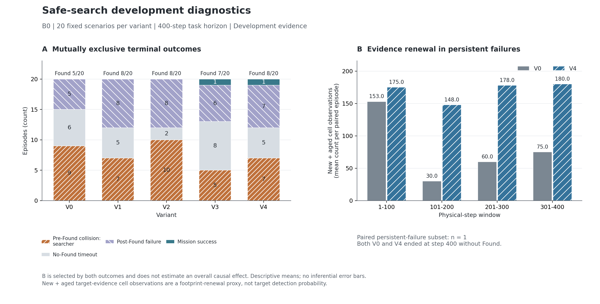

# 固定 20 场景完整回合开发评估与 Found 诊断

2026-09-28，本地 Windows AUV 环境，B0，V0–V4。

**代码修复、完整评估和全量核验已完成：20 个固定场景 × 5 个变体，共 100 个正常终止回合、27,790 个物理步，程序失败数为 0。** 所有回合保留原任务 400 步上限，碰撞或任务成功可提前结束。本轮没有训练或加载模型。

结果支持同时处理两类问题：基线因早期碰撞失去搜索机会，也因连续位置与缓存规划图失配而长期保留旧目标。V1 和 V4 将开发集 Found 从 25% 提至 40%，但 V2 说明“消除停滞”可能伴随更多碰撞。按原定安全优先工程规则选中 V3；它仍有严重停滞，不能作为已完成的最优方法或正式性能验收。

## 实验范围与实现

固定原始零基索引为 `0,3,7,10,22,28,31,40,42,46,62,63,67,76,77,78,86,91,95,97`，来自冻结的 [experiment_plan.json](../../3090_20260928/experiment_plan.json)。每个变体使用相同场景内容和 `12729 + 原始索引` 环境创新种子。下文病例使用原始零基索引；例如索引 7 对应场景文件编号 0008。

| 变体 | 启用内容 |
|---|---|
| V0 | 原 B0，关闭安全搜索干预 |
| V1 | 连续位置与规划状态的一致性刷新 |
| V2 | V1，加失败退避与分配恢复 |
| V3 | 公开路径几何安全检查与失效制动 |
| V4 | 全部干预 |

此次新增固定 20 场景的完整评估入口、严格的 100 回合分析器，以及只读的目标负证据观察足迹记录。记录器按原更新实际写入的网格时间戳统计新观察、重复观察、间隔至少 30 步的重访和智能体重叠；不向控制器提供额外信息。还修复了旧路径诊断把当前 guidance 与旧 tracker 索引混用时的越界问题：不匹配的几何值明确记为空，不修改跟踪状态或控制。

生产代码位于独立的 `chapter3_bser/experiments/safe_search_v1/`。没有修改 `core`、任务成功条件、感知、奖励、动力学或 28D/3D/124D 契约。B0 使用零残差先验，不需要重新训练。B1 尚只有此前有界接入验证；B2、B3、HGR 未纳入本轮结果。

## 完整结果

| 变体 | Found | 发现前碰撞 | 未发现超时 | 任务成功 | 停滞占比 | Hold 占比 |
|---|---:|---:|---:|---:|---:|---:|
| V0 | 5/20（25%） | 9/20（45%） | 6/20 | 0/20 | 40.87% | 0.00% |
| V1 | 8/20（40%） | 7/20（35%） | 5/20 | 0/20 | 4.07% | 0.00% |
| V2 | 8/20（40%） | 10/20（50%） | 2/20 | 0/20 | 0.01% | 0.00% |
| V3 | 7/20（35%） | 5/20（25%） | 8/20 | 1/20 | 37.41% | 4.64% |
| V4 | 8/20（40%） | 7/20（35%） | 5/20 | 1/20 | 0.20% | 3.22% |

Found 表示任务终止前发现目标；任务成功还要求完成后续交接与执行。所有变体的发现前碰撞者均为搜索者，待命执行者为 0。本批 Found 后的失败全是超时，没有发现后碰撞。任务成功最高仍只有 1/20，因此搜索改善不能替代后续阶段评价。

停滞是原 10 步稳定分配窗口下的运动代理，分母是三个搜索者的发现前 agent-step，且排除 Hold。V3 的停滞绝对数为 5,627，比 V0 的 4,723 多；其搜索曝光也更长。V3 的“停滞 + Hold”占比为 42.05%，高于 V0 的 40.87%。这不改变预注册筛选，但说明不能把表中的停滞占比小降解释为效率问题已经解决。

| 变体 | 发现前实际曝光总步数 | 每回合平均曝光步数 | 有效观察步数／曝光 | 平均唯一观察网格占比 | 截断发现时间均值 |
|---|---:|---:|---:|---:|---:|
| V0 | 3,852 | 192.60 | 1,055／3,852（27.39%） | 22.11% | 345.70 |
| V1 | 3,618 | 180.90 | 1,582／3,618（43.73%） | 26.79% | 310.75 |
| V2 | 3,116 | 155.80 | 1,425／3,116（45.73%） | 25.75% | 307.05 |
| V3 | 5,014 | 250.70 | 1,425／5,014（28.42%） | 25.48% | 314.35 |
| V4 | 4,114 | 205.70 | 1,859／4,114（45.19%） | 29.54% | 290.35 |

“有效观察步”仅指实际负证据足迹包含新网格或足够间隔重访的物理步，排除初始化、包含 Found 当步、排除之后；它不是检测概率或连续空间覆盖。原目标更新通常每两步发生一次，不能把其余步数直接视为无效动作。唯一观察网格占比以每场景 800 个网格为分母，再对 20 回合取平均。截断发现时间将所有未发现回合统一记为 400，包括提前碰撞，越小越好；它不是实际存活时间。

V3 的平均搜索曝光增加 58.10 步，但有效观察比例仅从 27.39% 到 28.42%。V4 的有效观察增加更多，同时仍存在丢失原本可发现病例的退化。各变体 Found 时刻和碰撞时刻不同，曝光、覆盖、查询总量不能脱离分母直接比较。

左图为全部 100 回合的互斥结局。右图只使用 V0、V4 均未发现且超时的共同病例，实际只有原索引 28 一例，不能作为总体效果估计。[PDF 图](figures/development_diagnostics.pdf) 与 [图表来源](figures/sources.json) 同时保留。

## 配对比较与工程选择

独立样本单位是 20 个场景，不是 100 个回合。以下为 10,000 次场景配对 percentile bootstrap，固定种子 20260928。

| 相对 V0 | Found 差值及 95% 区间（百分点） | 新增／丢失发现 | 发现前碰撞差值及 95% 区间（百分点） |
|---|---:|---:|---:|
| V1 | +15［−5，+35］ | 4／1 | −10［−25，0］ |
| V2 | +15［−5，+35］ | 4／1 | +5［0，+15］ |
| V3 | +10［0，+25］ | 2／0 | −20［−45，+5］ |
| V4 | +15［−15，+45］ | 6／3 | −10［−35，+15］ |

预设规则先要求机制检查通过、Found/发现前碰撞/停滞均不恶化且至少一个主指标改善，再按发现前碰撞等预定顺序筛选。V1、V3、V4 合格；V2 的碰撞从 9 场增至 10 场，不合格。V3 的 5 场碰撞最少，故被选中；未触发墙钟耗时排序，六进程并行耗时不用于性能裁决。

V3 新增发现索引 3、31，保留 V0 的全部 5 个 Found。V4 新增索引 31、42、63、67、77、86，却丢失索引 10、95、97：索引 10、97 变成未发现超时，索引 95 从第 273 步发现变成第 240 步发现前碰撞。不能只展示六个改善病例而隐去这三个退化病例。

固定开发集含 3 个已知诊断案例和 17 个按既定规则选择的案例；不是新独立测试。区间较宽，四次比较未做多重比较校正。V3 只是此规则下的开发工程选择，V4 的 40% 也只是观察到的开发结果，均不构成统计或泛化验收。

## Found 偏低的证据链

### 1. 早期搜索者碰撞直接截断搜索

V0 的 20 场中，9 场发现前碰撞、6 场未发现超时、5 场发现后超时。九次发现前碰撞步数为 14、18、19、22、36、44、50、92、243，中位数 36，七次不超过 50 步。因此安全存活是主要瓶颈之一。本批没有待命执行者造成的发现前碰撞，暂不优先修改其待命机制，但这不是全场景安全证明。

不能把九次碰撞统称为“拐弯惯性甩出路径”：六次碰撞前记录的横向偏差小于 0.30 m，索引 7、40 的下一段转角接近零。索引 86 的较大横向偏差与速度方向偏差值得复查；需要逐例区分线路自身危险、公开地图误判、发现过晚与实际跟踪偏差。

### 2. 连续位置接入失败，触发整次分配拒绝与旧目标滞留

V0 在发现前有 847,158 次 `no_start_connector`、24,833 次 `invalid_start`，以及 4,727 次 reachable 查询。查询数包含重复枚举，不是独立失败事件，更不是物理地图不可达率。

六个未发现超时病例为索引 0、28、31、42、63、91。它们的 373 次局部分配尝试中，345 次因搜索路线缺失被整次拒绝（92.49%），只有 28 次产生方案。345 个实际带查询的拒绝步中，三个搜索者的语义目标全部保持不变。766 条候选不足是逐智能体候选生成记录，不能写成 766 个失败回合。

源码与轨迹相互印证：`TravelCostService` 要求连续起点匹配当前缓存端点或精确网格中心；不满足时可在实际图搜索之前返回接入失败。原 B0 局部分配中，任一受影响搜索者缺少候选就保留整套旧分配，控制器随后继续使用旧目标。这条路径解释了“运动后起点失配 → 候选失败 → 整次拒绝 → 旧目标不更新 → 抵达后停滞”。不需要假设整个真实地图被障碍断开。

V1 在不加入几何安全模块时，把 `no_start_connector` 降至 2 次、停滞占比降至 4.07%，并新增四场 Found；这支持起点一致性修复的价值。但 V1 仍有 7 场发现前碰撞，单独修接入不能解决安全问题。

六个基线超时病例的最后 100 步，停滞为 1,345/1,800 个搜索者步（74.72%），有效观察为 90/600 步（15%）。其中只有索引 0 的最后 100 步完全没有新观察或足够间隔重访，连续 198 步只增加重复证据；另外五例仍更新部分有效足迹。应写成“更新效率低且部分病例停滞”，不能声称六例都停止感知。

### 3. 现有公开几何检查与制动仍有失效窗口

索引 7 的 V4 在第 84 步碰撞。补充只读公共地图回放与本轮该回合的完整有序签名一致，支持以下病例级解释：

- 第 24–77 步连续 Hold 54 步，净位移仍为 1.73 m，路径累计位移约 1.98 m。当前 Hold 每步把跟踪点设为当前位置，实际有限加速度动力学不会瞬间停车。
- 一处曾占据的阻挡体素在第 78 步由占据降至未知；当前未知可通过，因此旧路线恢复。第 82 步又成为占据并触发制动，第 84 步发生碰撞。这期间仍有新扫描，不能直接归因为没有感知。
- 第 82 步距真实障碍顶面约 0.0615 m、垂直速度约 −0.334 m/s（每个物理步为 0.2 s）；到第 83 步净空约 0.0100 m。现有制动未能及时停止。障碍真值只用于离线诊断，没有输入在线控制器。

详细数值见 [public_map_case_analysis.json](../public_map_case_analysis.json)，速度单位依据原环境的 `position += velocity × dt`。此病例支持测试占据记忆／清除迟滞、制动净空与稳定停驻目标；不能推断所有碰撞都由地图翻转造成，也没有证据判断具体哪条声呐射线造成清除。索引 40、62 的 V4 也出现开始 Hold 后一到两步碰撞，说明需要检查制动触发时机；索引 46 的长 Hold 漂移则提示保持阶段本身也需验证。

### 4. 恢复移动与增加网格观察并不保证遇到目标

V2 的停滞几乎清零，但碰撞增加；V4 虽将平均唯一网格观察占比提高到 29.54%，Found 仍只有 40%。V0/V4 共同未发现超时的索引 28，V4 的四个 100 步窗口新观察加间隔重访分别为 175、148、178、180，V0 为 153、30、60、75；两者仍均未发现。索引 10 中 V4 观察到 336 个唯一网格，超过 V0 的 262 个，却丢失 Found。

这些病例说明后续还需检查目标信念质量、搜索区域选择和路径上的有效探测机会；当前证据不能确定某个新的候选评分公式必然有效。不能把“持续运动”“观察网格更多”直接当作 Found 的替代指标。

## 下一轮具体优化方案

下面是基于本轮证据提出的开发方案，**尚未实现或验证为有效**。本轮 V0–V4 的代码和结果应保持封存，不在查看结果后改写原选择规则。

| 优先级 | 独立改动／对照 | 要回答的问题 | 验证重点 |
|---|---|---|---|
| 1 | 补做 V3 + V1，不启用 V2 失败恢复 | 能否保留 V3 的避碰收益，同时消除接入失配与旧目标停滞？ | 对照 V3、V4、V0；同一 20 场景完整回合；Found、发现前碰撞、停滞和 Hold、有效观察、新增／丢失病例同时报告 |
| 2 | 在选定开发基线上单独增加公开占据记忆与清除迟滞 | 曾知障碍降为未知时是否过早恢复危险路线？ | 先复核索引 7；再覆盖清除误报与窄通道，防止永久封路；只使用公开历史 |
| 3 | 分开测试保持首个安全停驻锚点、基于可用净空的提前减速 | Hold 漂移和触发过晚分别贡献多大？ | 已知剩余路线净空、实际速度、停距和 Hold 位移；验证恢复搜索，不修改动力学或清零速度 |
| 4 | 对仍失败搜索者实施独立候选重建，保留其他有效分配 | 能否减少单个候选失败拖住整队？ | 源码审阅、缺失分配／初始分配边界、图连通真实性、失败退避和安全恢复；避免复现 V2 的碰撞退化 |
| 5 | 在安全与接入稳定后，单独测试与目标信念和近期实际足迹有关的候选评分 | 持续运动为何没有转化为目标发现？ | 固定病例 28、10、97 只作诊断；总体仍用相同场景配对，不能只调到这三例通过 |

第一项是本轮消融矩阵缺少的组合，当前 V4 同时包含 V2，无法将其退化直接归咎于 V1 或某一个恢复模块。转弯限速应由曲率、侧偏和剩余净空触发的病例证据支持，不宜先统一大幅降速。待命执行者目前不是这 20 场景的首要碰撞来源。

继续使用 B0/B1 先验完成这些机制比较不需要训练。学习方法应在接入后先做固定权重评价，再根据控制分布变化决定是否重新训练；不能把本轮 B0 的提升外推给 B2、B3 或 HGR。

## 核验、来源与复现

- 修复后最近记录的本地定向测试为 **69/69 通过**，包括覆盖观测、真实模拟集成、完整入口、分析、来源和遥测。见 [development_verification_v2.json](../development_verification_v2.json)。这是本机验证，不是 CI 或全仓通过。
- 来源集合共 336 个文件，SHA-256 为 `8220c352e2b605c74e275701094195d77fbee53777e5554091f59556d157a33c`；演进清单 SHA-256 为 `6e8247919258eb35f96d0307dde93d9e1cbab3530b9b8bf02083737399207bec`。100 回合的来源及输入前后核验通过，27 条历史 provenance 保留。
- 100 个终止摘要与逐步轨迹、覆盖计数、顶层／子运行完全对账，全部 100 个回合具有有效的覆盖记录。配对主要计数、工程筛选及 Found／碰撞区间另行独立复算一致。
- 20 个 V0 的关键结局与旧 3090 B0 对应场景全部一致，场景 JSON 和原生配置一致。旧运行缺少完整软件环境信息，因此不宣称跨平台逐位等价。
- 首批 `development_B0_20260928_v1` 因诊断越界中断，原文件保留且不进入本次分母。该批已正常终止的 25 臂与新批有序签名全部相同。修复病例索引 10/V3 的有／无观察器完整 400 步对照中，401 个状态、观测、奖励、guidance、随机状态签名全部一致。
- 此前扩大检查中的两个旧 baseline 测试模块仍存在来源 gate 不兼容（历史记录 1 个失败、14 个报错）。没有修改或放宽它们；不得把本轮定向通过写成全仓全绿。历史 D1 记录保持原样。

机器可读紧凑证据见 [compact_evidence.json](compact_evidence.json)，基线链路和历史对照核验见 [baseline_audit.json](baseline_audit.json)。完整原始结果位于仓库本地 `runs/safe_search_v1/development_B0_20260928_v2/`，完整分析位于 `runs/safe_search_v1/development_analysis_B0_20260928_v2/`。逐窗口审计为 `runs/safe_search_v1/development_window_audit_B0_20260928_v2.json`。

[执行与复现说明](../development_runbook.md) 包含入口及后处理命令；[后续候选细化](../next_optimization_candidates.md) 列出具体实现边界。本次只结束固定 20 场景开发评估，其余 80 场景未执行，`performance_passed` 未建立。代码与紧凑文档可由 Git 跟踪；`runs/`、`outputs/`、`3090结果/` 和模型继续忽略。本次没有 commit 或 push。
